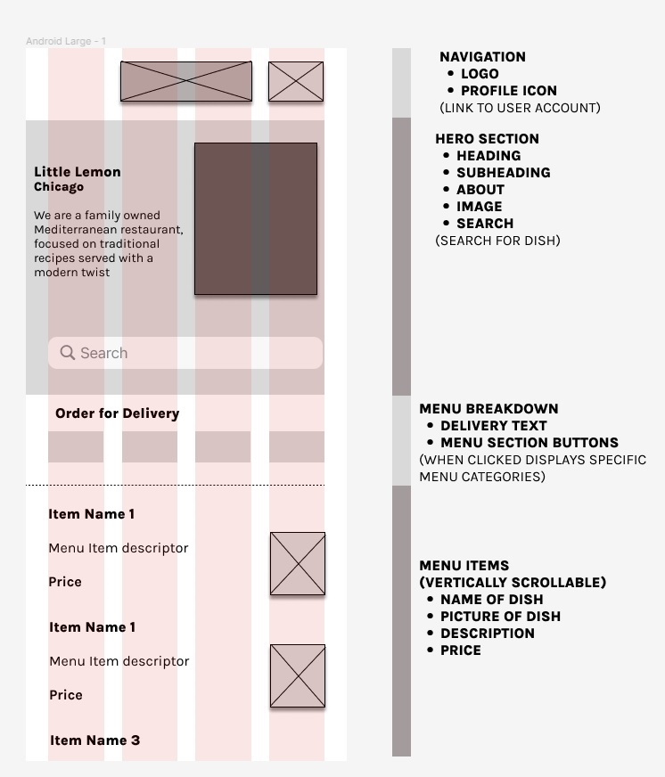

# AndroidCapstone

All code and documentation for the capstone project of the [Meta Android Developer Professional Certificate](https://www.coursera.org/professional-certificates/meta-android-developer).

## What does this app do?

Task is an "Android app for ordering food from the Little Lemon restaurant".

## Possible improvements:

- Use Little Lemon CI (colours, fonts, ....) as theme
- in the JSON file which is serialized there are wrong links to pictures for specific menu items. So these pics cannot be shown.

## How  to run the app?

- Clone this repository
- import folder in Android Studio
- Build
- Run the program and emulator

## How does the app look like?

